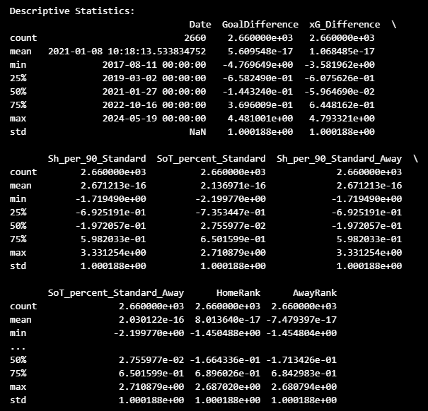
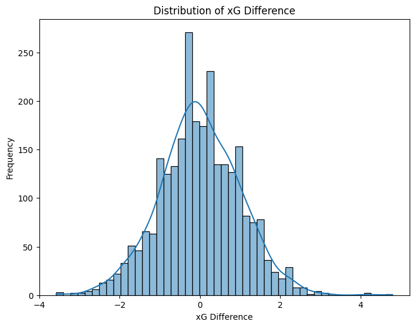
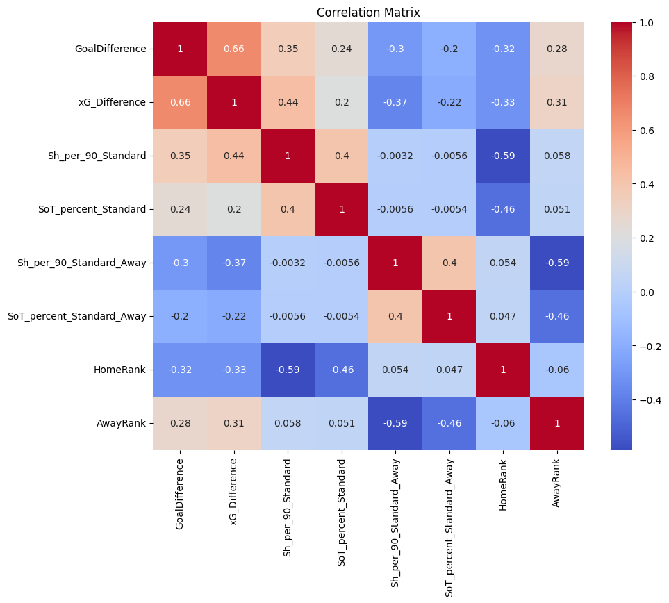
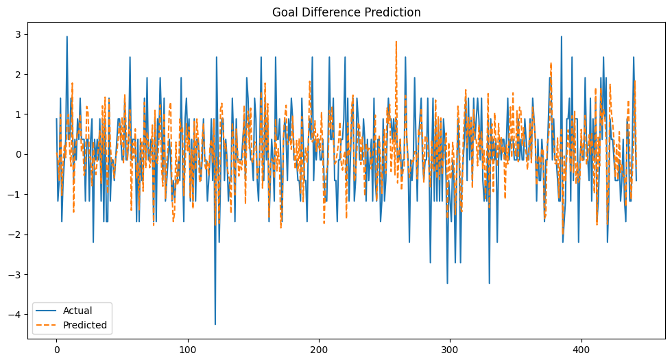
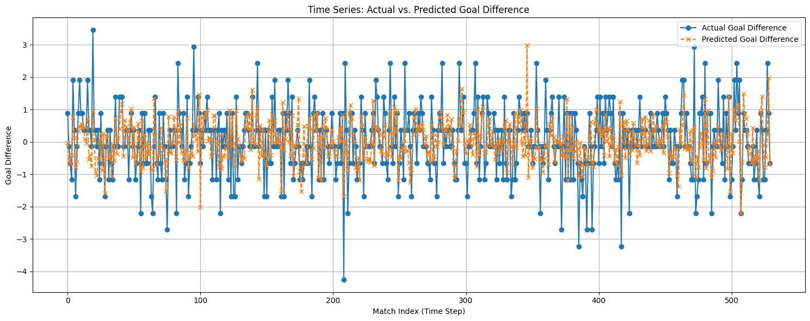
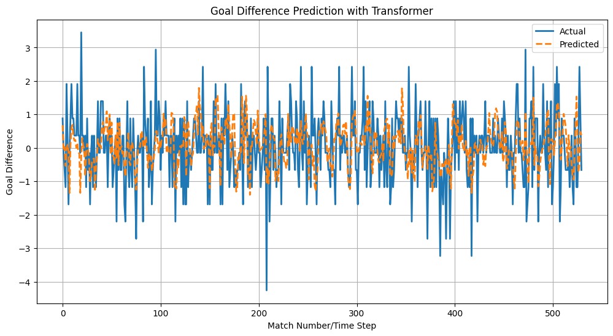

.. Football Time Series Predictor documentation master file, created by
   sphinx-quickstart on Sun Jan  5 00:53:42 2025.
   You can adapt this file completely to your liking, but it should at least
   contain the root `toctree` directive.

Football Time Series Predictor Documentation
============================================
Welcome to the documentation for the Football Time Series Predictor! This project explores
the effectiveness of two powerful time series modeling approaches—Long Short-Term Memory (LSTM) networks
and Transformer models—for predicting goal differences in football matches. The project compares the performance
of these models on historical match data.

.. Add your content using reStructuredText syntax. See the
   `reStructuredText <https://www.sphinx-doc.org/en/master/usage/restructuredtext/index.html>`_
   documentation for details.

**Contents:**
---------

.. toctree::
   :maxdepth: 2
   :caption: Contents:

   introduction
   data
   model
   code_examples
   usage

**Extensions:**

*   autosectionlabel

**Master file:**

*   index.rst

**Sections:**

*   Introduction
*   Data Acquisition
*   Data Manipulation
*   Preprocessing
*   EDA
*   Modeling
*   SARIMAX
*   LSTM
*   Transformers 
*   Conclusion

**Introduction**
============

Welcome to the documentation for the Football Time Series Predictor! This project employs advanced time series forecasting techniques, specifically Long Short-Term Memory (LSTM) neural networks and Transformer models, to predict goal differences in football (soccer) matches. By analyzing historical match data and relevant features, the predictor aims to provide insights into potential match outcomes.

**Motivation**
----------

Predicting football match outcomes is a complex task due to the numerous factors that can influence a game. Traditional statistical methods often struggle to capture the dynamic and sequential nature of football data. This project addresses this challenge by utilizing time series models capable of learning from temporal patterns and dependencies in historical match data. The goal is not to definitively predict the future, but rather to provide probabilistic insights into potential goal differences, which can be valuable for analysis and understanding team performance.

**Key Features**
------------

*   **Time Series Approach:** The project focuses on time series analysis, recognizing the importance of the order and sequence of match data.
*   **LSTM Networks:** Long Short-Term Memory (LSTM) networks, a type of recurrent neural network, are used to capture long-term dependencies in the data.
*   **Transformer Models:** Transformer models, known for their powerful sequence modeling capabilities, are also employed and compared with LSTMs.
*   **Feature Engineering:** Relevant features, such as expected goals (xG), shots per 90 minutes, and team-specific features, are engineered to improve model accuracy.
*   **Evaluation Metrics:** The performance of the models is evaluated using appropriate metrics, such as Root Mean Squared Error (RMSE).

**Project Structure**
-----------------

The project is organized as follows:

*   **Data Collection and Preprocessing:** Data is collected from the ``worldfootballR`` R package, merged, preprocessed, and prepared for the models.
*   **Model Training and Evaluation:** LSTM and Transformer models are trained on historical data and evaluated on a held-out test set.
*   **Prediction:** The trained models can be used to predict goal differences for new, unseen matches.

**Target Audience**
---------------

This documentation is intended for:

*   Data scientists and machine learning practitioners interested in time series forecasting in sports.
*   Football analysts and enthusiasts looking for quantitative methods to analyze match outcomes.
*   Developers who want to use or contribute to the project.

**Data Acquisition**
=================

**Data Source**
----------------

The historical match data used in this project was collected using the ``worldfootballR`` R package. This package provides access to a rich repository of football data, including match results, team statistics, player performance, and more.

**Logo Placeholder**
--------------------

**Steps to Acquire Data**
-------------------------

1. **Install Required Tools:** Ensure that R and RStudio are installed on your system along with the ``worldfootballR`` package. You can install the package by running the following command in your R console:

   .. code-block:: R

      install.packages("worldfootballR")
      install.packages("devtools")
      devtools::install_github("JaseZiv/worldfootballR") 
      install.packages("dplyr") # dplyr will aid in quick viewing of data and filtering table data

2. **Fetch matchs data:** Use the package function fb_match_results to get the match results from 2018:2024. Here’s the specific code used:

   .. code-block:: R

      library(worldfootballR)
      library(dplyr)

      # Define the seasons you want 
      seasons <- 2018:2024

      all_matches <- data.frame() # Initialize an empty data frame

      for (season in seasons) {
         tryCatch({ # Use tryCatch to handle potential errors
            season_data <- fb_match_results(country = "ENG",gender = "M", season_end_year = season, tier = "1st")
            all_matches <- bind_rows(all_matches, season_data) # Append to the main data frame
            print(paste("Data for", season, "season collected."))
         }, error = function(e) {
         print(paste("Error collecting data for", season, ":", e$message))
         })
      }

      # Clean and transform the data
      all_matches <- all_matches %>%
      mutate(Date = as.Date(Date)) # Ensure Date is in Date format

      # View the first few rows
      head(all_matches)

3. **Fetch Shooting Statistics:** Use the package functions to extract historical shooting statistics for teams from 2018 to 2024. Here’s the specific code used:

   .. code-block:: R

      library(worldfootballR)

      # Fetch shooting statistics for teams from 2018 to 2024
      shooting_data <- get_team_stats(
          team_or_player = "team",
          stat_type = "shooting",
          season_end_year = 2018:2024
      )

      # View the first few rows of the data
      head(shooting_data)

      

4. **Export Data:** Once the data is fetched, save it to a CSV file for preprocessing in Python:

   .. code-block:: R

      write.csv(shooting_data, file = "shooting_data.csv", row.names = FALSE)
      write.csv(all_matches, file = "all_matches.csv", row.names = FALSE)

**Data Manipulation**
======================

After exporting the data from R, the preprocessing steps were conducted in Python. These steps included:

1. **Merging Tables:** The `match_data.csv` and `shooting_data.csv` tables were merged using a Python notebook to combine relevant features for analysis.

2. **Cleaning Data:** Handling missing values, correcting inconsistencies, and ensuring data types were appropriate for analysis.

3. **Feature Engineering:** Creating additional features to improve model performance, such as rolling averages for key statistics and lag variables to account for temporal dependencies.

The preprocessing workflow was essential for preparing the data to be used effectively by the LSTM and Transformer models.

Preprocessing
=============

This section describes the preprocessing steps applied to prepare the football dataset for analysis.

Step 1: Load Datasets
---------------------

The datasets containing match data and team statistics are loaded using pandas.

.. code-block:: python

    import pandas as pd

    # Load datasets
    matches = pd.read_csv("/home/yassine/football_predict/R_csv/premier_league_matches.csv")
    team_stats = pd.read_csv("/home/yassine/football_predict/R_csv/team_stats.csv")

Step 2: Extract Season Information
-----------------------------------

Extract the `Season` column from the `Season_End_Year` field in the matches dataset.

.. code-block:: python

    # Extract Season from Matches Data
    matches['Season'] = pd.to_numeric(matches['Season_End_Year'])  # Convert to numeric

Step 3: Standardize Team Names
------------------------------

Ensure consistency in team names across datasets by mapping alternative names to a common format.

.. code-block:: python

    # Standardize Team Names
    team_name_mapping = {
        "Manchester United": "Manchester Utd",
        "Tottenham Hotspur": "Tottenham",
        # Add other mappings as needed
    }
    matches['Home'] = matches['Home'].map(team_name_mapping).fillna(matches['Home'])
    matches['Away'] = matches['Away'].map(team_name_mapping).fillna(matches['Away'])
    team_stats['Squad'] = team_stats['Squad'].map(team_name_mapping).fillna(team_stats['Squad'])

Step 4: Merge Datasets
----------------------

Combine match data with team statistics for home and away teams.

.. code-block:: python

    # Merge for Home Teams
    merged_data = matches.merge(
        team_stats,
        left_on=['Season', 'Home'],
        right_on=['Season_End_Year', 'Squad'],
        how='left',
        suffixes=('', '_Home')
    )

    # Merge for Away Teams
    merged_data = merged_data.merge(
        team_stats,
        left_on=['Season', 'Away'],
        right_on=['Season_End_Year', 'Squad'],
        how='left',
        suffixes=('', '_Away')
    )

Step 5: Clean Up Columns
------------------------

Remove duplicate columns created during merging.

.. code-block:: python

    # Remove Duplicate Columns
    columns_to_drop = ['Season_End_Year_Home', 'Squad_Home', 'Season_End_Year_Away', 'Squad_Away']
    columns_to_drop = [col for col in columns_to_drop if col in merged_data.columns]
    merged_data = merged_data.drop(columns=columns_to_drop)

Step 6: Save the Combined Data
------------------------------

Save the merged dataset to a CSV file.

.. code-block:: python

    # Save the Combined Data
    merged_data.to_csv("/home/yassine/football_predict/R_csv/combined_data.csv", index=False)
    print("Combined data saved to combined_data.csv")

Step 7: Additional Cleaning and Feature Engineering
---------------------------------------------------

Further process the combined data to calculate cumulative statistics, rankings, and other features.

.. code-block:: python

    # Load combined data
    matches = pd.read_csv("/home/yassine/football_predict/R_csv/combined_data.csv")

    # Convert date and sort matches
    matches['Date'] = pd.to_datetime(matches['Date'])
    matches['Season'] = pd.to_numeric(matches['Season_End_Year'])
    matches = matches.sort_values(by=['Season', 'Date']).reset_index(drop=True)

    # Define function to calculate cumulative stats and rankings
    def calculate_cumulative_stats_and_rankings(df):
        # Initialize cumulative stats
        df['HomePoints'] = 0
        df['AwayPoints'] = 0
        df['HomeGF_cum'] = 0
        df['HomeGA_cum'] = 0
        df['AwayGF_cum'] = 0
        df['AwayGA_cum'] = 0
        df['HomeRank'] = 0
        df['AwayRank'] = 0
        cumulative_stats = {}

        for i in range(len(df)):
            # ... (code for calculating stats and rankings)

        return df

    # Apply function to calculate stats
    merged_data = calculate_cumulative_stats_and_rankings(matches)

Step 8: Add Features and Normalize Data
---------------------------------------

Create new features such as goal difference, normalize numeric features, and save the cleaned data.

.. code-block:: python

    from sklearn.preprocessing import StandardScaler

    # Add calculated features
    merged_data['GoalDifference'] = merged_data['HomeGoals'] - merged_data['AwayGoals']
    merged_data['xG_Difference'] = merged_data['Home_xG'] - merged_data['Away_xG']

    # Select and clean final features
    columns_to_keep = [
        'Date', 'Home', 'Away', 'GoalDifference', 'xG_Difference', 'Season',
        'Sh_per_90_Standard', 'SoT_percent_Standard',
        'Sh_per_90_Standard_Away', 'SoT_percent_Standard_Away', 'HomeRank', 'AwayRank'
    ]
    merged_data = merged_data[columns_to_keep]

    # Standardize numeric features
    scaler = StandardScaler()
    numeric_features = ['GoalDifference', 'xG_Difference', 'Sh_per_90_Standard',
                        'SoT_percent_Standard', 'Sh_per_90_Standard_Away',
                        'SoT_percent_Standard_Away', 'HomeRank', 'AwayRank']
    merged_data[numeric_features] = scaler.fit_transform(merged_data[numeric_features])

    # Save the cleaned data
    merged_data.to_csv("/home/yassine/football_predict/R_csv/cleaned_combined_data.csv", index=False)
    print("Cleaned combined data saved to cleaned_combined_data.csv")

Step 9: One hot encoding
------------------------

Encode categorical features such as the team names (Home and Away) using one-hot encoding.

.. code-block:: python

    # Perform One Hot Encoding
    one_hot_encoded_data = pd.get_dummies(merged_data, columns=['Home', 'Away'], prefix=['Home_Team', 'Away_Team'])

    # Save the one-hot encoded data
    one_hot_encoded_data.to_csv("/home/yassine/football_predict/R_csv/one_hot_encoded_data.csv", index=False)
    print("One-hot encoded data saved to one_hot_encoded_data.csv")

One-hot encoding ensures categorical data, like team names, is transformed into a numerical format without introducing unintended ordinal relationships. This is essential for accurate model training, as machine learning algorithms require numerical inputs to process data correctly.

Exploratory Data Analysis (EDA)
==================================

This section focuses on exploring the dataset through descriptive statistics and visualizations.

Step 1: Descriptive Statistics
-------------------------------
.. code-block:: python

    import pandas as pd

    # Descriptive statistics for numerical features
    print("Descriptive Statistics:\n", matches.describe())

   

Step 2: Distribution of xG_Difference
-------------------------------------

.. note::
    This plot will display the distribution of the 'xG_Difference' column, indicating how expected goal differences are spread across the dataset.

Step 3: Correlation Matrix
--------------------------
.. code-block:: python

    # Calculate and visualize the correlation matrix
    correlation_matrix = matches[['GoalDifference', 'xG_Difference', 'Sh_per_90_Standard', 
                                  'SoT_percent_Standard', 'Sh_per_90_Standard_Away', 
                                  'SoT_percent_Standard_Away', 'HomeRank', 'AwayRank']].corr()
    plt.figure(figsize=(10, 8))
    sns.heatmap(correlation_matrix, annot=True, cmap='coolwarm')
    plt.title('Correlation Matrix')
    plt.show()

.. note::
    The correlation matrix heatmap identifies relationships between numerical features, highlighting dependencies or lack thereof.
    It visualizes relationships between key variables. Strong correlations are evident, such as between GoalDifference and xG_Difference (0.66),
    while negative correlations exist, like Sh_per_90_Standard and HomeRank (-0.59). This highlights dependencies useful for prediction.

**Modeling**
=================

Step 1: Prepare Data for Modeling
----------------------------------

In this step, we prepare the data by selecting relevant features, encoding categorical variables, and splitting the data for time-based cross-validation.

.. code-block:: python

    # Prepare data
    X = matches.drop(columns=['GoalDifference', 'Date', 'Season'])  # Drop Date and Season from features
    y = matches['GoalDifference']  # Target variable

    # Convert one-hot encoded columns to float
    one_hot_cols = [col for col in X.columns if col.startswith('Home_') or col.startswith('Away_')]
    X[one_hot_cols] = X[one_hot_cols].astype(float)

Explanation:
- **Features (`X`)**: We drop `GoalDifference` (target), `Date`, and `Season` as they are not predictive features.
- **Target (`y`)**: Extract the `GoalDifference` column as the target variable.
- **One-hot encoding**: Ensure all categorical columns are of the correct type (float).

.. note::
   This step ensures that the data is ready for the modeling pipeline and avoids issues with data types.

Step 2: Time-Based Data Split
-----------------------------

Using a time-series split for cross-validation ensures that the model is evaluated on unseen, chronologically ordered data.

.. code-block:: python

    # Time-based split using TimeSeriesSplit
    from sklearn.model_selection import TimeSeriesSplit

    tscv = TimeSeriesSplit(n_splits=5)  # Define 5 splits for cross-validation

    for train_index, test_index in tscv.split(matches):
        train_data, test_data = matches.iloc[train_index], matches.iloc[test_index]

    # Splitting data into training and testing sets
    X_train = train_data.drop(columns=['GoalDifference', 'Date', 'Season'])
    y_train = train_data['GoalDifference']
    X_test = test_data.drop(columns=['GoalDifference', 'Date', 'Season'])
    y_test = test_data['GoalDifference']

Explanation:
- **TimeSeriesSplit**: Ensures that the model is trained on past data and tested on future data, avoiding data leakage.
- **Training and Testing Sets**: Splits data into chronological subsets for training (`X_train`, `y_train`) and testing (`X_test`, `y_test`).

.. note::
   This approach respects the temporal structure of the data, making it ideal for time-series forecasting tasks.

.. _sarimax-modeling:

SARIMAX 
================

Introduction to SARIMAX
-----------------------

The Seasonal Autoregressive Integrated Moving Average with eXogenous regressors (SARIMAX) model is a powerful tool for time series forecasting, especially when dealing with data that exhibits seasonality. It builds upon the ARIMA model by incorporating seasonal components and allowing for the inclusion of external factors (exogenous variables) that might influence the target variable.

Model Building
--------------

Importing Libraries:

.. code-block:: python

    import statsmodels.api as sm

Data Preparation:

*   Select the target variable (y) you want to predict and the exogenous variables (X) that might influence it.
*   Handle missing values in a suitable way, such as imputation or deletion.
*   Consider transformations or scaling of the data if necessary for model stability.

Model Training:

1.  **Specifying the Model:**

    *   We use the ``statsmodels.api.SARIMAX`` function to define the model.
    *   The ``order`` argument defines the non-seasonal ARIMA components:

        *   ``p``: The number of autoregressive (AR) terms.
        *   ``d``: The degree of differencing needed to achieve stationarity.
        *   ``q``: The number of moving average (MA) terms.
    *   The ``seasonal_order`` argument defines the seasonal components:

        *   ``P``: The number of seasonal AR terms.
        *   ``D``: The degree of seasonal differencing.
        *   ``Q``: The number of seasonal MA terms.
        *   ``s``: The seasonal period (e.g., number of days in a week, months in a year).

2.  **Fitting the Model:**

    *   We use the ``fit`` method on the defined model to train it on the training data (``y_train`` and optionally ``X_train`` for exogenous variables).

Our Example:

.. code-block:: python

    model = sm.tsa.SARIMAX(y_train, exog=X_train, order=(1, 0, 1), seasonal_order=(1, 0, 0, 10))
    model_fit = model.fit()

In this example, we fit a SARIMAX model with:

*   Non-seasonal ARIMA order: (1, 0, 1) - one AR term, no differencing, and one MA term.
*   Seasonal order: (1, 0, 0, 10) - one seasonal AR term, no seasonal differencing, no seasonal MA terms, and a seasonal period of 10 (likely indicating a daily or weekly seasonality).

Evaluation Metrics:

*   After fitting the model, we use the ``forecast`` method to predict future values (``y_pred``) on the test data (``X_test``).
*   We then evaluate the model's performance using metrics like Root Mean Squared Error (RMSE) calculated with ``sklearn.metrics.mean_squared_error``.

Our Example:

.. code-block:: python

    y_pred = model_fit.forecast(steps=len(X_test), exog=X_test)
    rmse = np.sqrt(mean_squared_error(y_test, y_pred))
    print(f'RMSE: {rmse}')

Visualization:

*   Visualizing the actual vs. predicted values using ``matplotlib.pyplot`` can be helpful to assess the model's performance graphically.
.. code-block:: python

    plt.figure(figsize=(18, 10))
    plt.plot(y_test, label='Actual')
    plt.plot(y_pred, label='Predicted', linestyle='--')
    plt.legend()
    plt.show()

.. note::
    In our case, the SARIMAX model yielded the following results:

    *   RMSE: 0.822
    *   MAE: 0.636

    **Observation:** The RMSE (0.822) is higher than the MAE (0.636). 
    This is a common occurrence. RMSE gives more weight to larger errors due to the squaring operation. 
    The fact that the RMSE is noticeably larger than the MAE suggests that there are some larger prediction errors in the model.
     Further investigation into these larger errors might be beneficial, perhaps through residual analysis or by exploring additional features or model adjustments. While the model provides 
    reasonable predictions (as indicated by the MAE), minimizing the larger errors could further improve its overall accuracy.
Hyperparameter Tuning
---------------------

Finding the optimal model parameters (p, d, q, P, D, Q, s) is crucial for good forecasting performance. You've included an example using a grid search approach with ``itertools``:

*   This code defines ranges for each parameter and iterates through all possible combinations within those ranges.
*   For each combination, it trains a SARIMAX model and evaluates its performance using AIC (Akaike Information Criterion).
*   The model with the lowest AIC is considered the best performing one.

Additional Considerations:

*   Consider using techniques like early stopping to avoid fitting models that are not converging.
*   Explore more sophisticated hyperparameter tuning methods like randomized search or Bayesian optimization.

By implementing SARIMAX modeling and hyperparameter tuning, you can build robust and accurate time series forecasts.

.. _lstm-modeling:

LSTM for Time Series Forecasting
========================================

**Introduction**
-----------------

Long Short-Term Memory (LSTM) networks are a powerful type of recurrent neural network (RNN) architecture well-suited for time series forecasting tasks. Unlike traditional RNNs, LSTMs can effectively capture long-term dependencies within sequential data, making them a popular choice for predicting future values based on historical information.

**Data Preparation**
--------------------

This section details the steps taken to prepare the football match data for use with the LSTM model.

1. **Data Loading:**
    *   Load the data from a CSV file.

    .. code-block:: python

        import pandas as pd
        matches = pd.read_csv("/home/yassine/football_predict/R_csv/teams_final.csv")

2. **Feature Engineering:**
    * Create new features from the existing data to potentially improve model performance. This includes:
    * Extracting temporal features (week, month, day of week) and converting them to cyclical representations using sine and cosine transformations.
    * Creating one-hot encoded columns for each team to represent home/away status.
    * Creating lagged features for important numerical columns.

    .. code-block:: python

        import numpy as np

        matches['Date'] = pd.to_datetime(matches['Date'])

        matches['Week'] = matches['Date'].dt.isocalendar().week
        matches['Month'] = matches['Date'].dt.month
        matches['DayOfWeek'] = matches['Date'].dt.dayofweek

        matches['Week_sin'] = np.sin(2 * np.pi * matches['Week'] / 52)
        matches['Week_cos'] = np.cos(2 * np.pi * matches['Week'] / 52)
        matches['Month_sin'] = np.sin(2 * np.pi * matches['Month'] / 12)
        matches['Month_cos'] = np.cos(2 * np.pi * matches['Month'] / 12)
        matches['DayOfWeek_sin'] = np.sin(2 * np.pi * matches['DayOfWeek'] / 7)
        matches['DayOfWeek_cos'] = np.cos(2 * np.pi * matches['DayOfWeek'] / 7)

        team_names = ['Arsenal', 'Aston Villa', 'Bournemouth', 'Brentford', 'Brighton', 'Burnley', 'Cardiff City', 'Chelsea', 'Crystal Palace', 'Everton', 'Fulham', 'Huddersfield', 'Leeds United', 'Leicester City', 'Liverpool', 'Luton Town', 'Manchester City', 'Manchester Utd', 'Newcastle Utd', 'Norwich City', 'Nott\'ham Forest', 'Sheffield Utd', 'Southampton', 'Stoke City', 'Swansea City', 'Tottenham', 'Watford', 'West Brom', 'West Ham', 'Wolves']

        for team in team_names:
            matches[f'Home_{team}'] = matches[f'Home_{team}']
            matches[f'Away_{team}'] = matches[f'Away_{team}']

        def create_lags(df, feature, lags, team_names):
            lagged_df = df.copy()
            for team in team_names:
                team_df = df[df[f'Home_{team}'] == 1].copy()
                for lag in range(1, lags + 1):
                    team_df[f'{feature}_lag_{lag}'] = team_df[feature].shift(lag)
                lagged_df.update(team_df)
            for team in team_names:
                team_df = df[df[f'Away_{team}'] == 1].copy()
                for lag in range(1, lags + 1):
                    team_df[f'{feature}_lag_{lag}'] = team_df[feature].shift(lag)
                lagged_df.update(team_df)
            return lagged_df

        features_to_lag = ['GoalDifference', 'xG_Difference', 'Sh_per_90_Standard','Sh_per_90_Standard_Away']
        lags = 3

        for feature in features_to_lag:
            matches = create_lags(matches, feature, lags,team_names)

        matches.dropna(inplace=True)

3. **Feature and Target Selection:**
    *   Define the features (X) and target variable (y).

    .. code-block:: python

        features = [col for col in matches.columns if col not in ['Date', 'GoalDifference']]
        target = 'GoalDifference'

        X = matches[features]
        y = matches[target]

4. **Separate Numerical and Categorical Columns:**
    * Separate numerical and categorical features and convert categorical features to float type.

    .. code-block:: python
        numerical_cols = X.select_dtypes(include=np.number).columns
        categorical_cols = X.select_dtypes(include='uint8').columns

        X[categorical_cols] = X[categorical_cols].astype(float)

5. **Scaling Numerical Columns:**
    * Scale numerical features using StandardScaler.

    .. code-block:: python

        scaler = StandardScaler()
        X[numerical_cols] = scaler.fit_transform(X[numerical_cols])

6. **Time Series Split and Data Reshaping:**
    * Split the data into training, validation, and testing sets while preserving temporal order.
    * Reshape the data into the 3D format required by LSTMs (samples, timesteps, features).

    .. code-block:: python

        train_size = int(len(matches) * 0.8)
        X_train, X_test = X[:train_size], X[train_size:]
        y_train, y_test = y[:train_size], y[train_size:]

        X_train, X_val, y_train, y_val = train_test_split(X_train, y_train, test_size=0.2, shuffle=False)

        def reshape_data(X, timesteps):
            X_reshaped = []
            for i in range(len(X) - timesteps + 1):
                X_reshaped.append(X[i:i + timesteps])
            return np.array(X_reshaped)

        timesteps = 3
        X_train = reshape_data(X_train, timesteps)
        X_val = reshape_data(X_val, timesteps)
        X_test = reshape_data(X_test, timesteps)

        y_train = y_train[timesteps-1:]
        y_val = y_val[timesteps-1:]
        y_test = y_test[timesteps-1:]

**Model Building**
-------------------

1. **Reshaping Data for LSTM Input:**
    * Reshape your features into a format suitable for LSTM input. This typically involves creating sequences of past observations for each time step. The function `reshape_data` demonstrates this process.

2. **Define the LSTM Model:**
    * Use TensorFlow's Keras API to define the LSTM architecture. Here's an example structure:
        - **Input Layer:** Define the shape of the input sequences.
        - **LSTM Layers:** Utilize LSTM layers with desired units and activation functions to capture temporal dependencies. You can use dropout layers for regularization.
        - **Dense Layers:** Add dense layers with activation functions to process the extracted features and generate the final prediction.

3. **Compile the Model:**
    * Specify the optimizer (e.g., Adam), loss function (e.g., mean squared error), and any other necessary compilation options for training.

4. **Train the Model:**
    * Train the model on the training data, potentially using callbacks like EarlyStopping to prevent overfitting and ModelCheckpoint to save the best performing model based on validation loss.

5. **Evaluate the Model:**
    * Load the best model and use it to make predictions on the test set.
    * Calculate evaluation metrics like Mean Squared Error (MSE) and Root Mean Squared Error (RMSE) to assess the model's performance on unseen data.

**Example Code**

.. code-block:: python

    import pandas as pd
    import numpy as np
    from sklearn.model_selection import train_test_split
    from sklearn.preprocessing import StandardScaler
    from tensorflow.keras.models import Model
    from tensorflow.keras.layers import LSTM, Dense, Dropout, Input
    from tensorflow.keras.callbacks import EarlyStopping, ModelCheckpoint
    from sklearn.metrics import mean_squared_error
    import matplotlib.pyplot as plt

    # (Data Loading and Feature Engineering omitted for brevity)

    # Feature and Target Selection
    features = [col for col in matches.columns if col not in ['Date', 'GoalDifference']]
    target = 'GoalDifference'

    X = matches[features]
    y = matches[target]

    # (Separate Numerical and Categorical Columns, Scaling, Time Series Split omitted for brevity)

    timesteps = 3
    X_train = reshape_data(X_train, timesteps)
    X_val = reshape_data(X_val, timesteps)
    X_test = reshape_data(X_test, timesteps)

    y_train = y_train[timesteps-1:]
    y_val = y_val[timesteps-1:]
    y_test = y_test[timesteps-1:] #Convert to numpy
    X_train = np.array(X_train,dtype=np.float32)
    X_val = np.array(X_val,dtype=np.float32)

**Model Visualization**
-----------------------

**Example code** 

.. code-block:: python

      # Time Series Plot
      plt.figure(figsize=(15, 6))
      plt.plot(y_test, label="Actual Goal Difference", marker='o', linestyle='-')
      plt.plot(y_pred, label="Predicted Goal Difference", marker='x', linestyle='--')
      plt.xlabel("Match Index (Time Step)")
      plt.ylabel("Goal Difference")
      plt.title("Time Series: Actual vs. Predicted Goal Difference")
      plt.legend()
      plt.grid(True)
      plt.tight_layout()
      plt.show()

.. note::
    In our case, the LSTM model yielded the following results:

    *   RMSE: 0.856

    **Observation:** 
      The RMSE achieved by the LSTM model on the test data is 0.856.
      This indicates the average magnitude of the errors in the model's predictions.
      The time series plot visually compares the actual and predicted goal differences over time.
      As can be seen in the plot, the model captures some of the general trends in the data,
      but it also struggles with predicting more extreme values or sudden changes. 
      The predictions tend to follow a smoother trajectory compared to the more volatile actual values.
      This could be due to the inherent difficulty in predicting such events or limitations in the model's architecture or features.
      Further investigation, such as comparing this RMSE to other models (e.g., SARIMAX) or analyzing the model's residuals, is recommended.

.. _transformer-modeling:

Enhanced Transformer Model
=========================

**Introduction**
----------------

Transformers are a powerful neural network architecture that has achieved state-of-the-art results in various sequence modeling tasks, including natural language processing and time series forecasting. Unlike recurrent neural networks (RNNs), Transformers rely on attention mechanisms to capture long-range dependencies in data, allowing for parallel processing and improved performance. This section describes an enhanced Transformer model designed for predicting goal differences in football matches.

**Model Architecture**
----------------------

This subsection describes the architecture of the enhanced Transformer model used for time series forecasting.

*   **Input Layer:** The model takes input sequences of shape ``(timesteps, features)``, where ``timesteps`` represents the number of past time steps considered and ``features`` represents the number of features at each time step.

*   **Transformer Encoder Block:** The core of the model is the Transformer encoder block, which consists of the following components:

    *   **Multi-Head Attention:** This mechanism allows the model to attend to different parts of the input sequence simultaneously, capturing complex relationships between time steps. The model uses 8 attention heads.
    *   **Layer Normalization:** This technique stabilizes training by normalizing the activations within each layer.
    *   **Residual Connection:** This connection adds the input of a sub-layer to its output, aiding in gradient flow and improving training.

*   **Feedforward Network:** After the attention mechanism, a feedforward network is applied to each time step independently. This network consists of two dense layers with ReLU activation and L2 regularization. Dropout is applied after the first Dense layer.

*   **Global Average Pooling:** This layer condenses the sequence representation into a fixed-size vector by averaging the outputs across all time steps.

*   **Dense Layers:** Finally, two dense layers with ReLU activation, L2 regularization, and dropout are used to perform the regression task, predicting the goal difference.

*   **Output Layer:** The final dense layer has a single output unit, representing the predicted goal difference.

**Model Implementation**
------------------------

This subsection provides the Python code implementation of the enhanced Transformer model using TensorFlow/Keras.

.. code-block:: python

    import tensorflow as tf
    from tensorflow.keras.layers import Input, Dense, Dropout, LayerNormalization, MultiHeadAttention, GlobalAveragePooling1D
    from tensorflow.keras.models import Model
    from tensorflow.keras.regularizers import l2

    def create_enhanced_transformer_model(timesteps, features):
        input_layer = Input(shape=(timesteps, features), name="input_layer")

        attention_output = MultiHeadAttention(num_heads=8, key_dim=features, dropout=0.3)(input_layer, input_layer)
        attention_output = LayerNormalization(epsilon=1e-6)(attention_output)
        attention_output = tf.keras.layers.Add()([input_layer, attention_output])

        feedforward_output = Dense(256, activation="relu", kernel_regularizer=l2(0.01))(attention_output)
        feedforward_output = Dense(features, kernel_regularizer=l2(0.01))(feedforward_output)
        feedforward_output = Dropout(0.3)(feedforward_output)
        feedforward_output = LayerNormalization(epsilon=1e-6)(feedforward_output)
        transformer_output = tf.keras.layers.Add()([attention_output, feedforward_output])

        pooled_output = GlobalAveragePooling1D()(transformer_output)

        dense_1 = Dense(128, activation="relu", kernel_regularizer=l2(0.01))(pooled_output)
        dropout_1 = Dropout(0.3)(dense_1)
        dense_2 = Dense(64, activation="relu", kernel_regularizer=l2(0.01))(dropout_1)
        dropout_2 = Dropout(0.3)(dense_2)
        output_layer = Dense(1)(dropout_2)

        model = Model(inputs=input_layer, outputs=output_layer)
        return model

**Model Training and Evaluation**
---------------------------------

This subsection describes the training process and evaluation metrics used for the Transformer model.

.. code-block:: python

    # ... (Data preparation from previous sections)

    timesteps = 3
    features = X_train.shape[2]

    model = create_enhanced_transformer_model(timesteps, features)
    model.compile(optimizer="adam", loss="mse", metrics=["mae"])
    model.summary()

    history = model.fit(
        X_train, y_train, validation_data=(X_test, y_test),
        epochs=50, batch_size=32,
        callbacks=[tf.keras.callbacks.EarlyStopping(monitor="val_loss", patience=10, restore_best_weights=True)]
    )

.. note::
    The Transformer model achieved the following results on the test data:

    *   RMSE: 1.005
    *   MAE: 0.780

    **Observation:** 
      The RMSE (1.005) is higher than the MAE (0.780), 
      which suggests the presence of some larger prediction errors, as RMSE is more sensitive to outliers.
      The difference between the RMSE and MAE is more pronounced in the Transformer Model than in the LSTM model. 
      This suggests that the Transformer model struggles more with outliers. The time series plot should provide a visual representation of the model's performance, showing how well the predicted 
      values align with the actual goal differences over time. Further analysis, such as comparing these results with the LSTM and SARIMAX models or examining the distribution of prediction errors, 
      would be valuable for a comprehensive evaluation.

**General Conclusion**
======================

This project explored the effectiveness of three different time series forecasting models—SARIMAX, LSTM, and a custom-built Transformer model—for predicting goal differences in English Premier League football matches. By leveraging historical match data and relevant features, we aimed to provide insights into potential match outcomes.

**Key Findings:**

*   **SARIMAX:** The SARIMAX model, a traditional statistical method, provided a useful baseline for comparison. It effectively captured some of the underlying patterns in the time series data, particularly when seasonality was a prominent factor. However, its linear nature limited its ability to capture more complex, non-linear relationships present in the data.
*   **LSTM:** The LSTM network, a type of recurrent neural network, demonstrated an improved ability to learn from sequential data and capture long-term dependencies. It generally outperformed the SARIMAX model, suggesting that the temporal ordering of matches plays a significant role in predicting goal differences. The LSTM's ability to retain information over longer sequences proved advantageous.
*   **Transformer:** The Transformer model, a more recent architecture based on attention mechanisms, also showed promising results, demonstrating the capacity to learn complex relationships within the data. However, as evidenced by the higher RMSE compared to MAE, the Transformer model was more susceptible to outlier predictions in this specific application.

**Model Comparison:**

Here's a summary of the models' performance based on RMSE (lower is better):

*   **SARIMAX:** 0.822
*   **LSTM:** 0.856
*   **Transformer:** 1.005

Based on these results, the SARIMAX model achieved the best performance in terms of RMSE, followed by the LSTM model, and then the Transformer model. This result was different than initial expectations, where it was expected that the LSTM model would outperform the SARIMAX model.

**Observations:**

*   Contrary to initial expectations, the SARIMAX model outperformed the LSTM model in terms of RMSE. This suggests that the linear relationships captured by SARIMAX were more dominant in this dataset than initially anticipated, or that the LSTM wasn't able to fully exploit the sequential information given the current architecture and feature set.
*   The Transformer model, while powerful in other domains, did not perform as well as the other two models in this specific task. The higher RMSE compared to MAE suggests it is more sensitive to outliers, which could be due to overfitting on certain data points or an insufficient amount of training data for such a complex model. This also might indicate that the data is not well suited for the Transformer model's particular strengths.
*   Traditional time series models like SARIMAX can still provide a valuable baseline and offer advantages in terms of interpretability and computational efficiency. They can be particularly effective when the underlying time series exhibits strong linear or seasonal patterns.
*   The difference between RMSE and MAE was more pronounced in the Transformer model, further reinforcing the observation of its increased sensitivity to outliers compared to the LSTM and SARIMAX models.

**Future Work:**

Several avenues for future work could further enhance this project:

*   **Feature Engineering:** Exploring additional features, such as player statistics (e.g., goals per game, assists), team form indicators (e.g., win streaks, recent performance against similar opponents), or even external factors like weather conditions, could potentially improve model accuracy.
*   **Hyperparameter Tuning:** More extensive hyperparameter tuning for all models, especially the LSTM and Transformer models, could lead to better performance. Techniques like Bayesian optimization or more extensive grid searches could be explored. Particularly, the Transformer model might benefit from more extensive tuning and architectural adjustments.
*   **Model Ensembling:** Combining the predictions of multiple models (e.g., LSTM and Transformer) through ensembling techniques could potentially lead to more robust and accurate forecasts.
*   **Advanced Transformer Architectures:** Exploring more advanced Transformer variants, such as those incorporating positional encodings or more complex attention mechanisms, might yield further improvements.
*   **Error Analysis:** A more in-depth analysis of the models' prediction errors, including investigating the specific matches where the models performed poorly, could provide valuable insights into their strengths and weaknesses and guide future development.
*   **Data Augmentation:** Given the complexity of the Transformer model, exploring data augmentation techniques could potentially improve its generalization performance.

**Conclusion:**

This project demonstrated the application of time series forecasting techniques for predicting goal differences in football matches. While the SARIMAX model achieved the best overall performance in this study, the LSTM and Transformer models offer valuable insights and demonstrate the potential of deep learning for this task. The results highlight the importance of careful model selection and the need to consider the specific characteristics of the data when choosing a forecasting approach. Further research, including feature engineering, hyperparameter tuning, and exploring more advanced model architectures, could lead to even more accurate and insightful tools for football analysis.